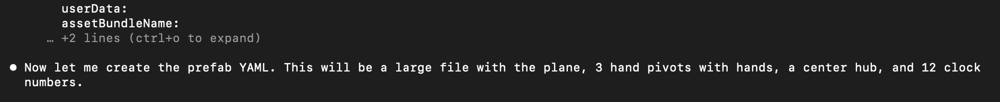
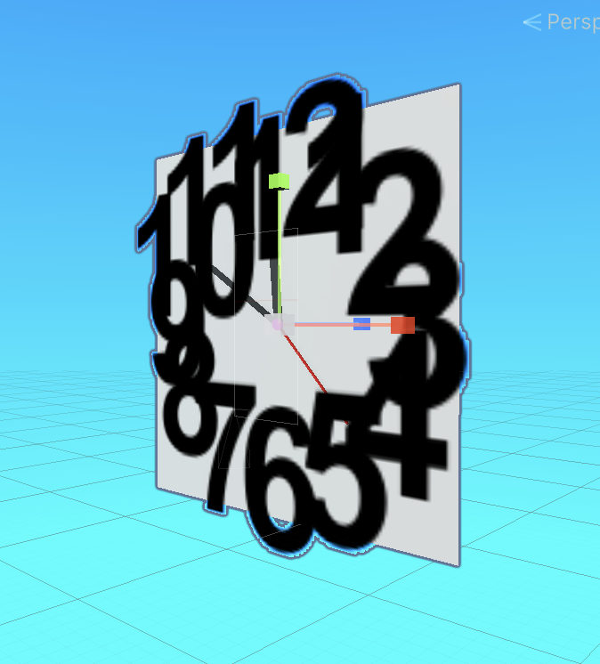

# Unity Prefabs for Claude Code

A Claude Code skill for generating and editing Unity `.prefab` files using the Claude Code Opus model. The skill provides comprehensive YAML reference knowledge — document structure, component wiring, nested prefabs, UI recipes, and more — so Claude can author and modify prefabs directly without opening the Unity Editor.

## Installation

### Option A — Project-level (shared with your team via repo)

```bash
cp unity-prefabs.md <your-project>/.claude/commands/unity-prefabs.md
```

### Option B — Global (available in all your projects)

```bash
cp unity-prefabs.md ~/.claude/commands/unity-prefabs.md
```

## Usage Examples

### Load as context before editing a prefab

```
/unity-prefabs
```

Then ask Claude to modify a prefab file. The skill primes Claude with the full YAML reference so it produces correct, serialization-safe edits.


### Creating a functioning clock from a one liner prompt






### Add a TMP_Dropdown to an existing prefab

> `/unity-prefabs` then "Add a TMP_Dropdown to MyCanvas.prefab under the SettingsPanel GameObject"

Claude will generate all 12 required GameObjects (Dropdown, Label, Arrow, Template, Viewport, Content, Item, Item Background, Item Checkmark, Item Label, Scrollbar, Sliding Area, Handle) with correct cross-references.

### Wire a nested button prefab's click event

> `/unity-prefabs` then "Wire the PlayButton nested prefab's onClick to call OnPlayTapped on the GameStartPanel script"

Claude will create the stripped entries, clear the Unity Button's `m_OnClick`, and configure the custom wrapper's `onClick` via PrefabInstance property modifications.

## What's Included

- Prefab YAML document structure and fileID rules
- GameObject + Component wiring patterns (3D and UI)
- Built-in component GUIDs (Image, TMP, Button, Dropdown, Toggle, ScrollRect, etc.)
- Standard Unity sprite references
- Nested prefab handling (PrefabInstance, stripped entries, SerializeField wiring)
- Event callback wiring and retargeting for nested prefabs
- Full TMP_Dropdown hierarchy recipe (12 GameObjects)
- Modification checklist to avoid common mistakes

## Requirements

- [Claude Code](https://docs.anthropic.com/en/docs/claude-code) CLI
- Claude Opus model (recommended for best results with complex prefab generation)
- Unity 6+ project

## License

MIT
